# TodoApp_Slint
Use Slint C++ to build todo app
You can test TodoApp by open this **./build/Debug/my_application.exe**
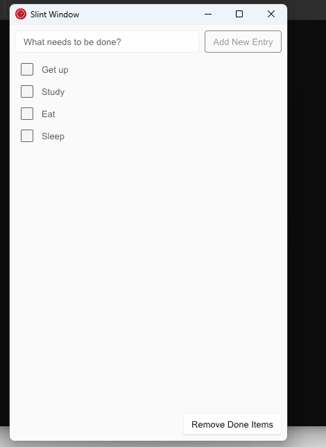
* This App has **3 functions:** Add New Entry, Check Todo Lists, Remove Done Item use C++ API
* **Src C++: src/Main.cpp** 
* **Src Slint: ui/MySlint.slint**
# Learn to coding it
## **1.Import Library and create Struct**
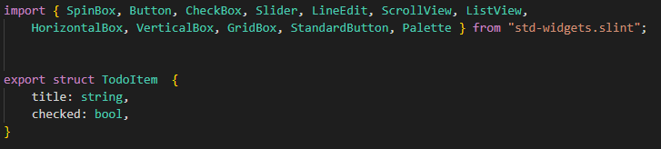

## **2.Create Callback(functions) and lists**
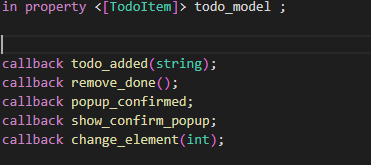

## **3.Create ui for add List**
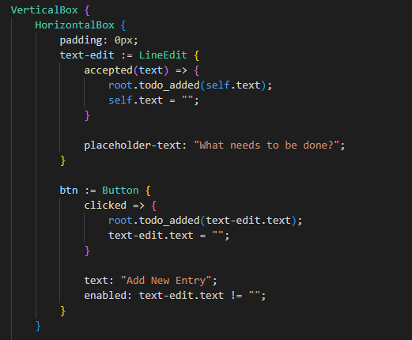

## **4.Create ui for List**
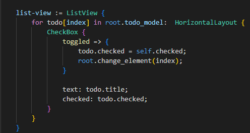
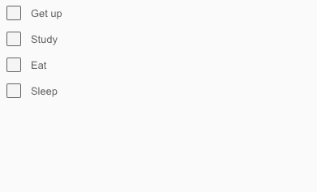

## **5.Create Remove function and PopupWindow to confirm**
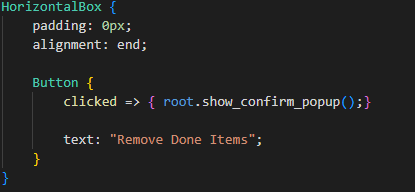

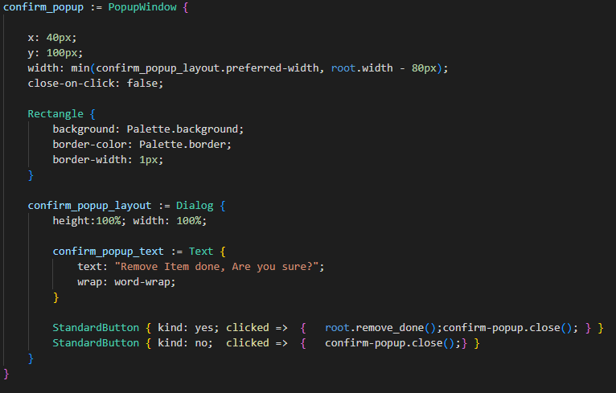

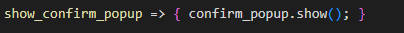

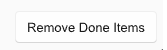

## **6.Use C++ for Init Program**
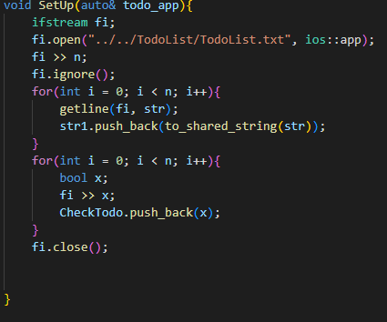
* Use file TodoList.txt to save TodoList

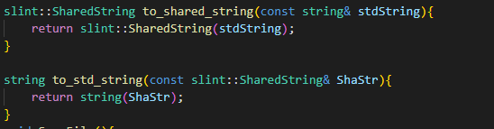
* Convert slint::SharedString to std::string and std::string to slint::SharedString

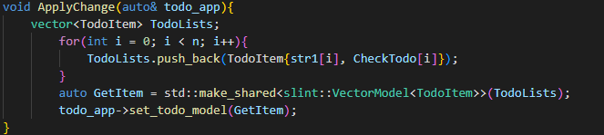
* Use Vector Model to set todo_model in slint(list todo)

## **7.Use C++ for define callback**
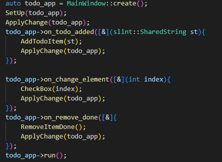

## **8.Write function for app**
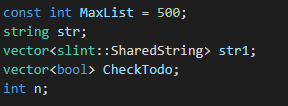

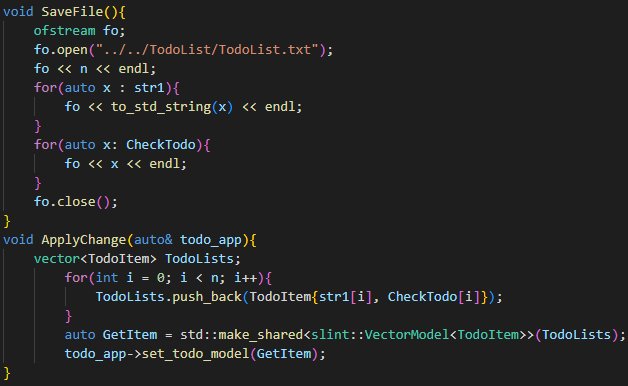

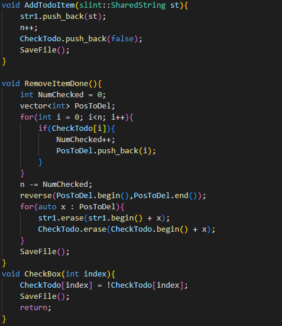
